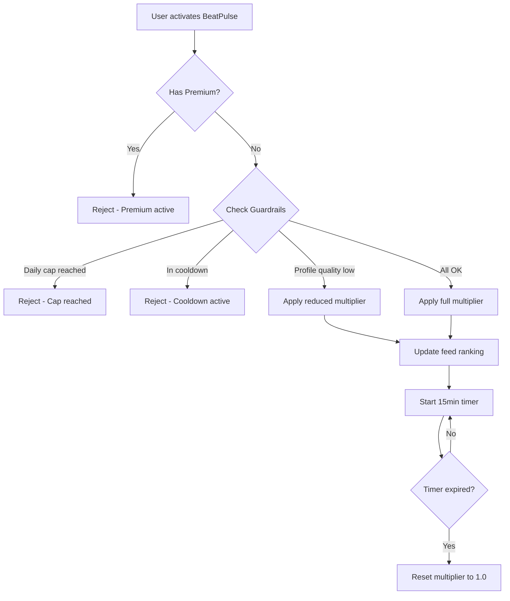

# 🧠 Pulse — BeatPulse Exposure Boost Logic

> **Developer-Ready Specification (V1, Locked)**

---

## 1️⃣ מטרת הפיצ׳ר

להעלות זמנית את החשיפה של משתמש ב־Home + Nearby feeds מבלי:
- לשנות מרחק / מיקום
- לחשוף למשתמש "סטטיסטיקות"
- ליצור תחושת גיימיפיקציה

**BeatPulse = exposure boost שקט.**

---

## 2️⃣ פרמטרים מוצריים (Locked)

| Parameter | Value |
|-----------|-------|
| **משך** | 15 דקות |
| **מחיר** | 70 נקודות |
| **משפיע על** | Home + Nearby |
| **שקיפות למשתמש** | אין "מספר צפיות", אין "הגעת ל־X אנשים", אין דוחות |
| **מקור אמת** | שרת בלבד |

### כללים גלובליים של Points (חלים במלואם):
- Feature אחד בלבד פעיל בכל רגע
- Feature חדש מפסיק קיים מיידית
- Premium פעיל ← Points מבוטלים (אין BeatPulse דרך נקודות)

---

## 3️⃣ אילו פידים מושפעים

### ✅ Home Feed
BeatPulse מעלה את ההסתברות שהמשתמש יופיע "מוקדם יותר" אצל אחרים (early placement).

### ✅ Nearby Feed
BeatPulse מעלה דירוג/קדימות בתוך אותה קבוצת רלוונטיות.

### ❌ לא משנה מרחק

### ❌ לא "עוקף" פילטרים קיימים (גיל/מרחק/דת/וכו')

---

## 4️⃣ BeatPulse Scoring Model (Locked)

### עקרון מרכזי
BeatPulse הוא **Multiplier על score קיים** — לא מנגנון חדש.

```
final_score = base_score * beatpulse_multiplier
```

### beatpulse_multiplier

| State | Multiplier |
|-------|------------|
| BeatPulse פעיל | 1.15 – 1.35 (קונפיג בשרת) |
| לא פעיל | 1.0 |

**❗ חשוב:** multiplier מוגבל (cap) כדי לא להפוך את הפיד ל"pay-to-win".

---

## 5️⃣ Guardrails (חובה)

### 5.1 Frequency Caps

מגבלות כדי למנוע abuse:

| Guardrail | Value | Notes |
|-----------|-------|-------|
| Max activations/day | 3 | קונפיג בשרת |
| Cooldown between activations | 30 דקות | קונפיג בשרת |

### 5.2 Quality Filter

BeatPulse לא מופעל (או מופעל בעוצמה נמוכה) אם:
- הפרופיל מתחת ל־Profile Strength threshold (למשל < 70%)
- המשתמש flagged באמון/בטיחות
- המשתמש "new user" ב־probation (אופציונלי)

### 5.3 No Double Advantage

אם יש מנגנון Nearby Priority נפרד (גם נקודות):
- **BeatPulse + Nearby Priority לא נערמים** כי Points לא נערמים.
- בשרת מגדירים priority מי מנצח (ברירת מחדל: החדש מפסיק הישן).

---

## 6️⃣ UX חוקים (Client)

### 6.1 UI בתוך Points Hub

- BeatPulse מופיע ככרטיס Spend Points (15 min / 70 pts)
- אם פעיל: מוצג ב־Active Feature עם countdown
- ❌ **אין תצוגת "תוצאות"**

### 6.2 UI מחוץ ל־Points Hub

| Item | Allowed |
|------|---------|
| Badge "Boosting" | ❌ |
| הודעות "את/ה עכשיו מוצג/ת יותר" | ❌ |
| Toast מיוחד | ❌ |

---

## 7️⃣ Analytics (Internal Only)

### מותר למדוד פנימית בלבד:
- `feature_started` / `feature_ended` (כמו כל נקודות)
- KPI פנימי: uplift על matches / likes

### אבל:
❌ **לא להציג למשתמש כלום מזה.**

---

## 🔒 מה אסור למפתחים לעשות ❌

| Forbidden | Reason |
|-----------|--------|
| ❌ להציג סטטיסטיקות למשתמש | No gamification |
| ❌ לשנות פילטרים/מרחק | Only affects ranking |
| ❌ stacking עם features אחרים | Single feature rule |
| ❌ לחשב multiplier ב-Client | Server only |
| ❌ להציג UI מחוץ ל-Points Hub | Silent boost |

---

## ✅ Acceptance Criteria

- [ ] BeatPulse משפיע רק דרך multiplier ל-score
- [ ] לא משנה פילטרים ולא מרחק
- [ ] אין stacking (feature יחיד)
- [ ] עובד Home + Nearby
- [ ] אין UI/metrics למשתמש מחוץ ל־Points Hub
- [ ] הכל שרת-אוכף
- [ ] Guardrails (daily cap + cooldown) פעילים
- [ ] Premium override עובד

---

## 📊 Flow Diagram



---

**Last Updated:** January 2026  
**Version:** 1.0
