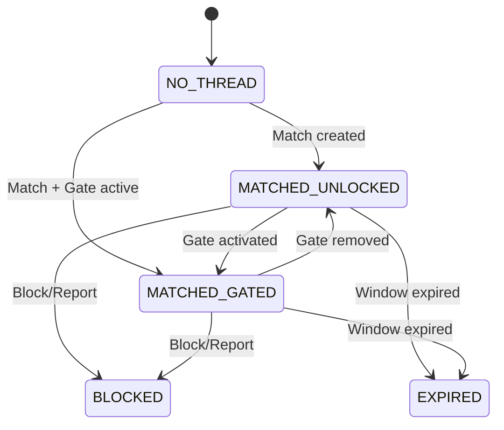

# 💬 Pulse — Chat Feature Gates

> **Developer-Ready Specification (V1)**

---

## 1️⃣ מטרת המערכת

להגדיר בצורה חד־משמעית:
- מתי צ׳אט נפתח
- מתי הודעה נשלחת/נחסמת
- מתי מותר "unlock" זמני עם Points
- מה קורה כש־Feature פג באמצע פעולה
- איך הכל נשמר עקבי בין iOS/Android/backend

**⚠️ אין פרשנות לקליינט: השרת מקור אמת.**

---

## 2️⃣ ישויות בסיס (Models)

### ChatThread
```typescript
interface ChatThread {
  threadId: string;
  participants: [string, string]; // [userIdA, userIdB]
  state: ThreadState;
  createdAt: string; // ISO timestamp
  lastMessageAt: string | null;
  gates: GateState;
}
```

### GateState
```typescript
interface GateState {
  canSendMessage: boolean;
  blockReason: BlockReason | null;
  cta: {
    type: CTAType;
    label: string;
  } | null;
  expiresAt?: string; // For time-limited unlocks
}

type BlockReason = 
  | 'NEED_MATCH'
  | 'SUBSCRIPTION_REQUIRED'
  | 'POINTS_FEATURE_REQUIRED'
  | 'GATED_BY_RULE'
  | 'SYSTEM_BLOCKED';

type CTAType = 
  | 'BUY_SUBSCRIPTION'
  | 'USE_POINTS'
  | 'NONE';
```

---

## 3️⃣ Chat Thread States (Locked)

ה־thread יכול להיות רק באחד מהמצבים:

| State | Description |
|-------|-------------|
| `NO_THREAD` | אין חוט שיחה (טרם נוצר) |
| `MATCHED_UNLOCKED` | מאצ׳ פתוח, הודעות מותרות |
| `MATCHED_GATED` | יש מאצ׳ אבל הודעות חסומות |
| `BLOCKED` | נחסם (דיווח/בטיחות/חסימה ידנית) |
| `EXPIRED` | חלון תקשורת פג (אם יש windowed chat) |



---

## 4️⃣ כללי פתיחת צ׳אט (Core Rules)

### ✅ מותר לשלוח הודעה אם ורק אם:
- יש thread קיים
- `state == MATCHED_UNLOCKED`
- אין `BLOCKED`
- `canSendMessage == true` מהשרת

### ❌ חסום לשליחה אם:

| blockReason | Description |
|-------------|-------------|
| `NEED_MATCH` | אין מאצ׳ |
| `GATED_BY_RULE` | thread gated |
| `SUBSCRIPTION_REQUIRED` | דורש Premium |
| `POINTS_FEATURE_REQUIRED` | דורש Points unlock |
| `SYSTEM_BLOCKED` | Moderation/Safety |

---

## 5️⃣ Feature Gates בתוך צ׳אט

### A) Subscription Gate

אם הודעות דורשות Premium:

```json
{
  "canSendMessage": false,
  "blockReason": "SUBSCRIPTION_REQUIRED",
  "cta": {
    "type": "BUY_SUBSCRIPTION",
    "label": "Unlock messaging with Premium"
  }
}
```

**חשוב:** אם המשתמש כבר Premium — אין gates מבוססי points בכלל.

### B) Points Gate (Unlock זמני)

אם unlock הודעות בעזרת נקודות:

```json
{
  "canSendMessage": false,
  "blockReason": "POINTS_FEATURE_REQUIRED",
  "cta": {
    "type": "USE_POINTS",
    "label": "Unlock 10 min messaging (70 pts)"
  },
  "pointsCost": 70,
  "unlockDuration": 10
}
```

**Rules:**
- עלות נקודות
- משך זמן
- אי־סטאקינג (כמו points rules)

### C) Safety/Report Gate

אם אחד הצדדים חסם/דווח/סומן:

```json
{
  "canSendMessage": false,
  "blockReason": "SYSTEM_BLOCKED",
  "cta": null
}
```

**אין CTA לפתוח — לא ניתן לשלם כדי לפתוח.**

---

## 6️⃣ UI Behavior (Client Rules)

### Header (Top)
מציג:
- שם + תמונה
- סטטוס קטן (אופציונלי): Active now / Paused / Offline

**לא מציג סיבות חסימה כאן** (רק ב־Gate Banner)

### Gate Banner (בצ׳אט עצמו)

מופיע רק כש־`canSendMessage=false`

כולל:
- Title קצר (לפי blockReason)
- Subtitle (הסבר בשורה אחת)
- CTA יחיד (אחד בלבד)

| blockReason | Title | Subtitle | CTA |
|-------------|-------|----------|-----|
| `NEED_MATCH` | Match first | You can message after you match | None |
| `SUBSCRIPTION_REQUIRED` | Premium required | Messaging is unlocked with Premium | View Premium |
| `POINTS_FEATURE_REQUIRED` | Unlock messaging | Unlock 10 minutes of messaging with points | Use Points |
| `SYSTEM_BLOCKED` | Chat unavailable | This conversation is no longer available | None |

### Composer (שורת הקלט)

**אם חסום:**
- הקלט Disabled
- Placeholder לפי חסימה (למשל "Messaging locked")

**אם פתוח:**
- רגיל

---

## 7️⃣ Real-time Updates (Critical)

כל שינוי ב־Gate חייב להתעדכן:
- פתיחת Premium
- הפעלת Feature points
- סיום טיימר
- חסימה/דיווח

הקליינט:
- **לא "מנחש"**
- מקבל push/poll/refetch ומרנדר מחדש

---

## 8️⃣ Edge Cases (חובה)

| Case | Expected |
|------|----------|
| Feature פג בזמן שהמשתמש כותב | בלחיצה על Send → חסימה עם reason עדכני |
| משתמש קונה Premium באמצע צ׳אט gated | נפתח מייד, composer נפתח |
| Server lag | כפתור Send מראה loading, אין שליחה כפולה |
| Double-send | השרת חייב idempotency |
| Block בזמן שיחה | הצ׳אט עובר ל־BLOCKED, composer נסגר |

---

## 9️⃣ API Contract

### GET /v1/chat/threads/{threadId}/gates
```json
{
  "canSendMessage": true,
  "blockReason": null,
  "cta": null
}
```

### POST /v1/chat/threads/{threadId}/unlock
```json
// Request
{ "method": "points" }

// Response
{
  "success": true,
  "unlockExpiresAt": "2026-01-07T21:30:00Z",
  "gates": {
    "canSendMessage": true,
    "blockReason": null,
    "cta": null
  }
}
```

### Error Codes

| Code | HTTP | Message |
|------|------|---------|
| `INSUFFICIENT_POINTS` | 402 | Not enough points to unlock |
| `ALREADY_UNLOCKED` | 409 | Chat is already unlocked |
| `THREAD_BLOCKED` | 403 | This conversation is blocked |

---

## 🔟 Analytics Events

| Event | Trigger | Payload |
|-------|---------|---------|
| `chat_gate_viewed` | Gate banner shown | `thread_id`, `block_reason` |
| `chat_gate_cta_tapped` | CTA button tapped | `thread_id`, `cta_type` |
| `chat_unlocked` | Gate removed | `thread_id`, `unlock_method` |
| `chat_blocked` | Thread blocked | `thread_id`, `block_reason` |
| `chat_message_blocked` | Send attempted while gated | `thread_id`, `block_reason` |

---

## 🔒 מה אסור למפתחים לעשות ❌

| Forbidden | Reason |
|-----------|--------|
| ❌ לחשב gates ב-Client | Server is source of truth |
| ❌ לאפשר שליחה אם `canSendMessage=false` | Must respect server state |
| ❌ להציג CTA ל-SYSTEM_BLOCKED | No payment bypass for safety |
| ❌ לנחש מצב after feature expires | Must refetch from server |
| ❌ לשלוח כפול בזמן loading | Idempotency required |

---

## ✅ Acceptance Criteria

- [ ] Composer disabled when gated
- [ ] Gate banner shows correct reason
- [ ] CTA navigates to correct screen
- [ ] Real-time updates work
- [ ] Points unlock has timer
- [ ] Premium unlock is permanent
- [ ] SYSTEM_BLOCKED has no CTA
- [ ] Server is always source of truth

---

**Last Updated:** January 2026  
**Version:** 1.0
