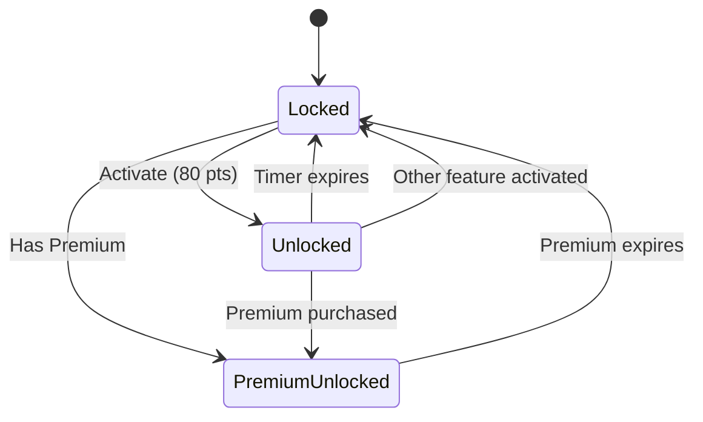
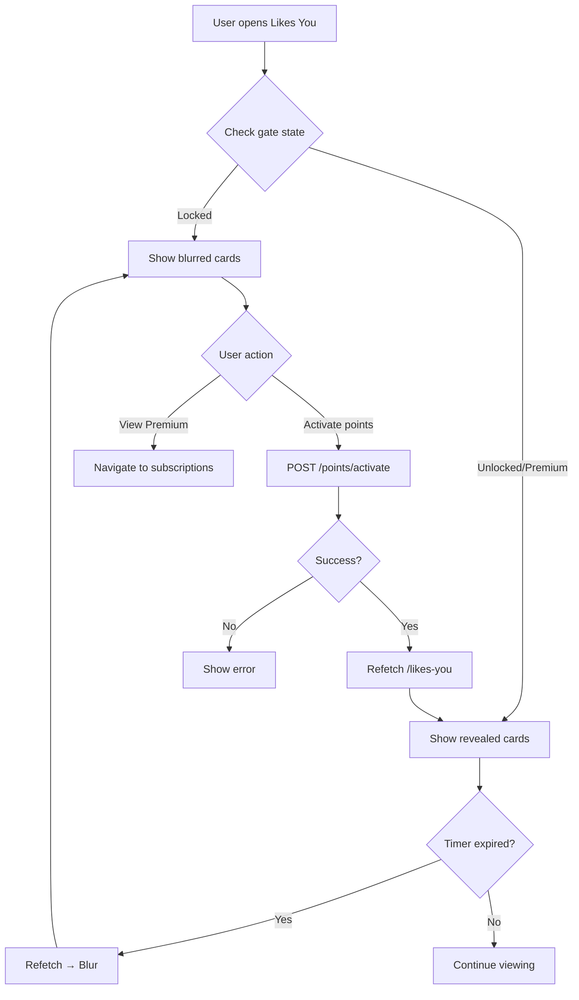

# ❤️ Pulse — Likes You Reveal Logic

> **Developer-Ready Specification (V1, Locked)**

---

## 1️⃣ מטרת הפיצ׳ר

לאפשר למשתמש "טעימה" קצרה של יכולת פרימיום:
- לראות מי עשה לו Like
- באופן מלא (ללא blur)
- למשך זמן קצר וקבוע
- בלי לשבור את הערך של Subscription

---

## 2️⃣ פרמטרים מוצריים (Locked)

| Parameter | Value |
|-----------|-------|
| **משך** | 10 דקות |
| **מחיר** | 80 נקודות |
| **מה נפתח** | רשימת "Likes You" מלאה + תמונות + פרטים מינימליים |
| **מה לא נפתח** | יכולות נוספות (Backtrack/Beats/Incognito וכו') |

### כללים גלובליים של Points (חלים במלואם):
- Feature אחד בלבד פעיל
- Feature חדש מפסיק קיים מיידית
- Premium פעיל ← Points כבויים

---

## 3️⃣ מה המשתמש רואה (UX)

### 3.1 מצב Locked (ברירת מחדל)

מסך "Likes You" מוצג, אבל:
- כרטיסים/תמונות **מטושטשים (blur)** או masked
- אין אפשרות לפתוח פרופיל מלא מתוך הכרטיס

**CTA יחיד:**
- `Unlock for 10 minutes (80 points)`
- או `View Premium` (אם אין מספיק נקודות / או אם רוצים להדגיש פרימיום)

### 3.2 מצב Unlocked (במהלך 10 דקות)

- הרשימה מוצגת **ללא blur**
- הרשימה מרועננת מיידית עם פתיחה (server refresh)

**ניתן:**
- להיכנס לכרטיס משתמש/פרופיל כמו רגיל
- לבצע Like/Pass על מי שעשה Like

**מוצג Timer קטן בחלק העליון/ב־banner:**
```
Active now · 09:31
```

### 3.3 מצב Expired

- חזרה אוטומטית ל־blur
- אם המשתמש נמצא בתוך המסך:
  - הרשימה "מתכסה" מחדש
  - מוצג hint קצר: `Session ended`

**❌ אין חגיגות**
**❌ אין מסך סיום**
**❌ אין "קנית הצלחה"**

---

## 4️⃣ Data Rules (Server Truth)

### 4.1 Likes List Source of Truth

- רשימת ה־likes מגיעה מהשרת בלבד
- הלקוח **לא "שומר"** רשימת unblur בזיכרון כדי להמשיך להציג אחרי פקיעה

### 4.2 Refresh Behavior (Locked)

בעת פתיחת Likes You עם נקודות:

1. השרת מאשר פתיחה
2. השרת מחזיר gates updated + expiry
3. הלקוח עושה **refetch likes list מיידית**

מהנקודה הזו, כל בקשה מחזירה:
- **unblur מלא** אם feature פעיל
- **blur/limited** אם לא פעיל

---

## 5️⃣ Edge Cases (חובה)

| Case | Expected |
|------|----------|
| Feature פג באמצע גלילה | ברענון הבא / פולינג → חוזר ל־blur |
| יציאה מהאפליקציה | הטיימר ממשיך בשרת |
| מעבר בין מסכים | ה־unlock נשמר עד פקיעה |
| מנוי נרכש באמצע | feature points נפסק מייד, Likes You נשאר פתוח בגלל Premium |
| הפעלת Feature אחר (Undo/BeatPulse וכו') | Likes You נסגר מיידית |

---

## 6️⃣ UI States

### State Machine



### UI Components per State

| State | Photo | Name | Age | Distance | Actions |
|-------|-------|------|-----|----------|---------|
| Locked | Blurred | Hidden | Hidden | Hidden | CTA only |
| Unlocked | Visible | Visible | Visible | Visible | Like/Pass |
| Premium | Visible | Visible | Visible | Visible | Like/Pass |

---

## 7️⃣ Security Rules

### 🔒 No Data Leakage

| Rule | Implementation |
|------|----------------|
| Server returns null | When locked, `photoUrl=null`, `displayName=null` |
| No client caching | Don't store revealed data locally |
| No URL guessing | Photo URLs are signed/temporary |
| API enforcement | Server validates gate state on every request |

---

## 🔒 מה אסור למפתחים לעשות ❌

| Forbidden | Reason |
|-----------|--------|
| ❌ לשמור תמונות/שמות ב-client | Data leakage risk |
| ❌ להציג blur על data קיים | Must refetch from server |
| ❌ לנחש gate state | Server is source of truth |
| ❌ להציג סטטיסטיקות | No gamification |
| ❌ חגיגות/animations בפקיעה | Silent expiry |

---

## ✅ Acceptance Criteria

- [ ] 10 דקות מדויקות (server timer)
- [ ] Refresh מיידי בפתיחה
- [ ] Blur חוזר אוטומטית בפקיעה
- [ ] אין leakage של תמונות/פרטים אחרי פקיעה
- [ ] נקודות never parity עם premium (זמני ומתסכל)
- [ ] Feature switching works correctly
- [ ] Premium override works

---

## 📊 Flow Diagram



---

**Last Updated:** January 2026  
**Version:** 1.0
