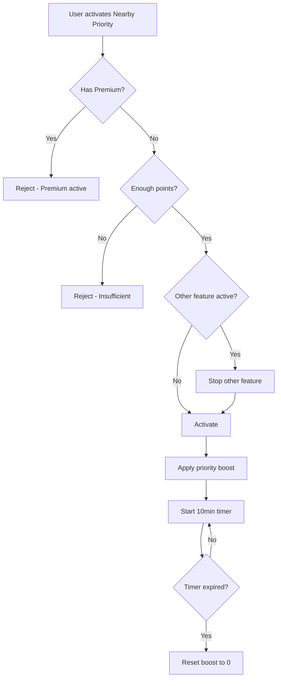

# 📍 Pulse — Nearby Priority Ranking Boost Logic

> **Developer-Ready Specification (V1, Locked)**

---

## 1️⃣ מטרת הפיצ׳ר

לתת למשתמש דחיפה זמנית בתוך Nearby כדי:
- להופיע מוקדם יותר/בולט יותר בפיד Nearby של אחרים
- בלי לשנות נתוני מיקום
- בלי לגרום לתחושת "זיוף מרחק"
- בלי לחשוף לאף אחד שזה פעיל

---

## 2️⃣ פרמטרים מוצריים (Locked)

| Parameter | Value |
|-----------|-------|
| **משך** | 10 דקות |
| **מחיר** | 70 נקודות |
| **משפיע על** | Nearby feed בלבד |
| **לא משנה** | distance, GPS, radius, filters |
| **Visibility** | בלתי נראה לאחרים (אין badge/אין "boosted") |
| **Server truth** | תמיד שרת |

### Rules של Points (חלים במלואם):
- Feature אחד פעיל בכל רגע
- חדש מפסיק קיים מיידית
- Premium פעיל ← Points disabled

---

## 3️⃣ מה בדיוק משתנה במערכת (Server)

Nearby Priority מוסיף **priority weight** לדירוג של המשתמש ב־Nearby של אחרים.

### מודל מומלץ (Additive):
```
final_score = base_score + nearby_priority_boost
```

### חלופה (Multiplicative):
```
final_score = base_score * multiplier
```

### 🔒 Locked Rule

לבחור אחד מהשניים ולהישאר עקבי.

**ב־V1 מומלץ Additive** כדי:
- לא "לשבור" ranking
- לשמור על ניהול cap קל

---

## 4️⃣ Guardrails (חובה)

### 4.1 Cap

`nearby_priority_boost` מוגבל (cap) כדי לא לעקוף כל רלוונטיות.

**לדוגמה:** boost מקדם רק עד X מקומות קדימה.

### 4.2 Filter Safety

הפיצ׳ר **לא רשאי לעקוף**:
- מרחק (distance filter)
- גיל
- דת/העדפות
- blocks/reports
- privacy constraints

### 4.3 Single Feature Rule

אם BeatPulse פעיל ומופעל Nearby Priority:
- BeatPulse מסתיים מיידית
- Nearby Priority מתחיל (לפי rules של points)

---

## 5️⃣ UX חוקים (Client)

### בתוך Points Hub

**Card:** Nearby Priority
- 10 min — 70 points

**בזמן פעיל:**
- מופיע ב־Active Feature + countdown
- ❌ אין טקסט "אתה עכשיו ראשון"
- ❌ אין נתונים מספריים

### מחוץ ל־Points Hub

| Item | Allowed |
|------|---------|
| Badge | ❌ |
| הודעת push | ❌ |
| Toast מיוחד | ❌ |

---

## 6️⃣ Edge Cases (חובה)

| Case | Expected |
|------|----------|
| יוצא מהאפליקציה | הטיימר ממשיך |
| פקיעה | ranking חוזר לבסיס |
| שרת מתעכב | client לא מנחש |
| Premium באמצע | points feature נפסק; premium לפי ההגדרות |
| הפעלת Feature אחר | Nearby Priority נפסק מייד |

---

## 7️⃣ Nearby Priority vs BeatPulse

| Aspect | Nearby Priority | BeatPulse |
|--------|-----------------|-----------|
| **Scope** | Nearby only | Home + Nearby |
| **Duration** | 10 min | 15 min |
| **Cost** | 70 pts | 70 pts |
| **Model** | Additive boost | Multiplier |
| **Stacking** | ❌ No | ❌ No |

---

## 🔒 מה אסור למפתחים לעשות ❌

| Forbidden | Reason |
|-----------|--------|
| ❌ לשנות distance | Only affects ranking |
| ❌ לעקוף filters | Filter safety required |
| ❌ להראות badge לאחרים | Invisible feature |
| ❌ להציג סטטיסטיקות | No gamification |
| ❌ stacking עם features אחרים | Single feature rule |
| ❌ לחשב boost ב-Client | Server only |

---

## ✅ Acceptance Criteria

- [ ] Nearby בלבד
- [ ] אין שינוי מרחק/מיקום
- [ ] אין stacking
- [ ] בלתי נראה לאחרים
- [ ] דירוג משתנה רק דרך שרת
- [ ] Cap + filter safety קיימים
- [ ] 10 דקות מדויקות
- [ ] Feature switching works

---

## 📊 Flow Diagram



---

**Last Updated:** January 2026  
**Version:** 1.0
