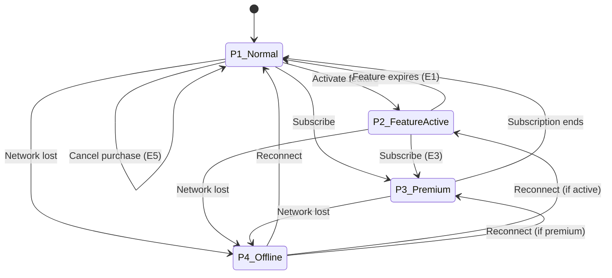

# 🧩 Pulse Points Hub — Edge Case Matrix

> **Server × UI × Actions (V1, Locked)**

---

## 1️⃣ משתני מצב (State Inputs)

### Server Inputs (אמת)

| Variable | Type | Description |
|----------|------|-------------|
| `pointsBalance` | int | Current points balance |
| `activeFeature` | null / {feature, expiresAt} | Currently active feature |
| `subscriptionActive` | bool | Premium subscription status |
| `purchaseInProgress` | bool (client-only) | UI purchase state |
| `networkState` | online/offline | Network connectivity |

### Derived UI Flags (רק לציור)

```javascript
canActivateFeature = (!subscriptionActive) && 
                     (activeFeature == null) && 
                     (pointsBalance >= cost)

featuresLockedByActive = activeFeature != null

pointsDisabledByPremium = subscriptionActive == true
```

---

## 2️⃣ Matrix — מצבים עיקריים

### ✅ מצב P1 — רגיל (אין Feature פעיל, אין Premium)

**Server:**
```json
{
  "subscriptionActive": false,
  "activeFeature": null
}
```

**UI:**
| Element | State |
|---------|-------|
| Balance | מוצג |
| Active Feature section | לא מוצג |
| Feature cards | Enabled אם יש מספיק נקודות |
| Feature cards | Disabled אם אין מספיק נקודות |
| Buy Points packages | פעילים |

**Actions:**
| Action | Allowed |
|--------|---------|
| Activate | ✅ מותר |
| Buy | ✅ מותר |

---

### ⛔ מצב P2 — Feature פעיל (אין Premium)

**Server:**
```json
{
  "subscriptionActive": false,
  "activeFeature": { "id": "undo", "expiresAt": "..." }
}
```

**UI:**
| Element | State |
|---------|-------|
| Active Feature | מוצג + countdown |
| Feature cards | Disabled: "Unavailable while feature is active" |
| Buy Points packages | פעילים |

**Actions:**
| Action | Allowed | Notes |
|--------|---------|-------|
| Activate Feature אחר | ❌ חסום ב-UI | |
| Hack request | שרת מחליף Feature או 409 | |

---

### 🟣 מצב P3 — Premium פעיל

**Server:**
```json
{
  "subscriptionActive": true
}
```

**UI:**
| Element | State |
|---------|-------|
| Balance | מוצג או מוסתר (החלטה מוצרית) |
| Feature cards | Disabled: "Included in Premium" |
| Buy Points | disabled/hidden |
| Premium text | "Premium unlocks everything — anytime" |

**Actions:**
| Action | Response |
|--------|----------|
| Activate points feature | 403 SUBSCRIPTION_ACTIVE |
| Buy points | חסום (לא לפתוח checkout) |

---

### 📴 מצב P4 — Offline / No Internet

**Server:** לא זמין

**UI:**
| Element | State |
|---------|-------|
| Content | Skeleton / Loading |
| Retry button | Visible |
| Balance | לא מציגים ישן |
| All buttons | Disabled |

**Actions:**
| Action | Allowed |
|--------|---------|
| Activate | ❌ חסום |
| Buy | ❌ חסום |

---

### 🕒 מצב P5 — Server Lag / Timeout

**Server:** איטי

**UI:**
| Element | State |
|---------|-------|
| Loading indicator | ברור |
| Fallback values | אין |
| Activate/Buy | Loading with timeout |

**Actions:**
| Action | Behavior |
|--------|----------|
| Double tap | Prevented |
| After timeout | "Something went wrong. Please try again." |

---

## 3️⃣ Matrix — אירועים מיוחדים

### ⚡ E1 — Feature פג בזמן שהמשתמש במסך

**Trigger:** `now >= activeFeature.expiresAt`

**Expected:**
- Active Feature section נעלם
- Feature cards חוזרים ל-enabled/disabled לפי נקודות
- Hint קצר (אופציונלי): "Session ended"

---

### ⚡ E2 — Feature חדש הופעל ממסך אחר

**Trigger:** Activation ב-Home/Chat/gate

**Expected:**
- Points Hub ברענון מציג Feature פעיל
- כל cards נעולים
- Timer מדויק לפי שרת

---

### ⚡ E3 — Premium נרכש בזמן Feature פעיל

**Trigger:** `subscriptionActive` הופך `true`

**Expected:**
| Item | Behavior |
|------|----------|
| Feature points | נפסק מיידית (שרת) |
| Active Feature UI | נעלם |
| Points disabled | מופעל |
| Compensation | ❌ אין |
| Refund | ❌ אין |

---

### ⚡ E4 — רכישת נקודות הסתיימה

**Trigger:** Store validate success

**Expected:**
- Balance עולה מיידית
- Cards שדרשו יותר נקודות הופכים enabled
- (אם אין Feature פעיל ואין Premium)

---

### ⚡ E5 — רכישה בוטלה (cancel)

**Expected:**
| Item | Behavior |
|------|----------|
| Balance | אין שינוי |
| Toast | ❌ אין חגיגי |
| Error | ❌ אין (שקט) |

---

### ⚡ E6 — הפעלת Feature כאשר אין מספיק נקודות (race)

**Trigger:** UI חשב שיש מספיק, אבל בשרת balance ירד

**Expected:**
- שרת מחזיר 409 INSUFFICIENT_POINTS
- UI: toast "Not enough points"
- Balance refresh

---

## 4️⃣ Error Codes (Locked)

| Code | When | UI Response |
|------|------|-------------|
| `INSUFFICIENT_POINTS` | לא מספיק נקודות | Toast + refresh |
| `SUBSCRIPTION_ACTIVE` | Premium פעיל | Toast + disable |
| `FEATURE_ALREADY_EXPIRED` | פג לפני העדכון | Refresh UI |
| `VALIDATION_FAILED` | Receipt לא תקין | Error state + support link |

---

## 5️⃣ State Transition Diagram



---

## 6️⃣ QA Test Coverage

| Edge Case | Test ID | Priority |
|-----------|---------|----------|
| P1 Normal state | PH-P1-01 | High |
| P2 Feature active | PH-P2-01 | Critical |
| P3 Premium active | PH-P3-01 | Critical |
| P4 Offline | PH-P4-01 | High |
| P5 Server lag | PH-P5-01 | Medium |
| E1 Feature expiry | PH-E1-01 | Critical |
| E2 External activation | PH-E2-01 | High |
| E3 Premium during feature | PH-E3-01 | Critical |
| E4 Purchase success | PH-E4-01 | High |
| E5 Purchase cancel | PH-E5-01 | Medium |
| E6 Race condition | PH-E6-01 | High |

---

## ✅ Definition of Done (Matrix)

- [ ] כל מעבר מצב מופיע ב־QA checklist
- [ ] אין פעולה שמביאה למסך "לא ברור מה קורה"
- [ ] Server תמיד מקור אמת
- [ ] אין double actions
- [ ] כל error code מטופל
- [ ] UI מתעדכן בזמן אמת

---

**Last Updated:** January 2026  
**Version:** 1.0
