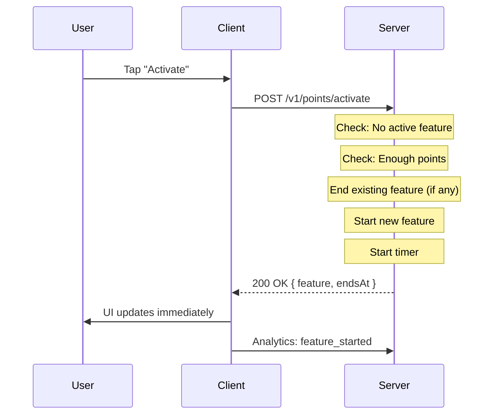
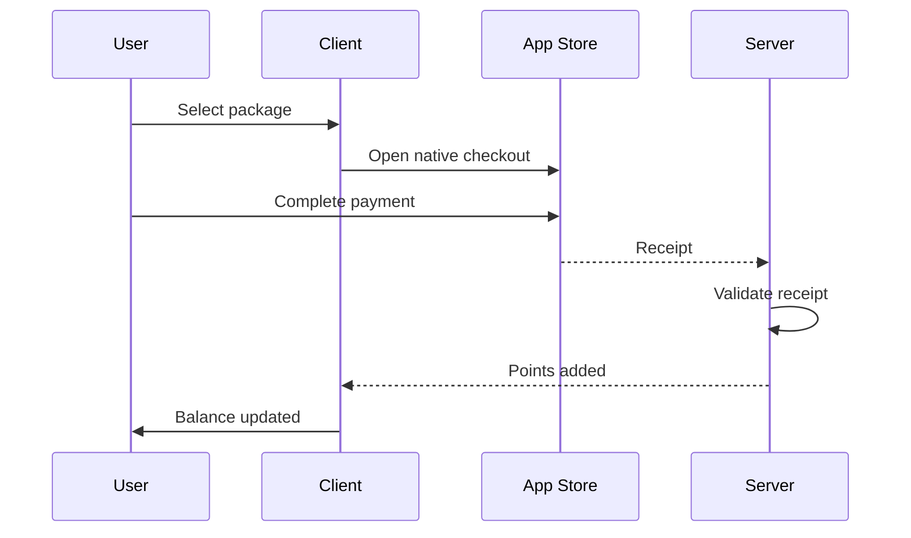

# 📱 Pulse — Points Hub / Points Store

> **Developer-Ready Specification**

---

## 1️⃣ מטרת הדף

לאפשר למשתמש:
- לראות את יתרת הנקודות שלו
- להבין האם יש Feature פעיל כרגע
- להפעיל Boost זמני אחד בלבד באמצעות נקודות
- לרכוש נקודות (One-time purchase)
- להבין ש־Subscription עדיף בלי לדחוף בכוח

**⚠️ זה לא מסך גיימיפיקציה**  
**⚠️ זה לא מטבע וירטואלי**  
**⚠️ זה מנגנון "טעימה מתסכלת בכוונה" לעומת פרימיום**

---

## 2️⃣ מיקום וכניסות למסך

### Primary Entry
- Edit Profile → Points Banner

### Secondary Entries
- Chat (Sticky banner)
- Home (Promo card)
- Feature Gate (כאשר חסום)

**כל הכניסות מובילות לאותו מסך Points Hub**

---

## 3️⃣ חוקים גלובליים (חסומים, לוגיקה שרתית)

🔒 **מפתחים לא רשאים לשנות:**

| Rule | Description |
|------|-------------|
| Single Feature | אין פתיחה של יותר מ־Feature אחד במקביל |
| Immediate Replace | Feature חדש מפסיק מיידית Feature קיים |
| No Stacking | נקודות לא נערמות בין Features |
| No Refunds | נקודות לא מוחזרות |
| No Expiry | נקודות לא פגות תוקף |
| Sub Override | מנוי פעיל ← Points מבוטלים לחלוטין |
| Server Only | כל הטיימרים והאכיפה — Server only |
| Dumb Client | ה־Client מציג בלבד (Dumb renderer) |

---

## 4️⃣ מבנה המסך (Top → Bottom)

### 🔹 Section A — Header

| Element | Description |
|---------|-------------|
| Title | "Your Points" |
| Balance | Large display (e.g., "150 Points") |
| Source | Server only, real-time |
| Animation | ❌ No celebration animation |

### 🔹 Section B — Active Feature (Conditional)

**מוצג רק אם Feature פעיל**

| Element | Description |
|---------|-------------|
| Feature name | e.g., "Undo" |
| Label | "Active now" |
| Timer | Countdown (mm:ss) |

**התנהגות:**
- טיימר נספר מהשרת
- סגירת אפליקציה לא עוצרת טיימר
- אם פג ← ה־Section נעלם מייד

### 🔹 Section C — Spend Points (Feature Cards)

**רשימת Cards קבועה (לא דינמית לפי A/B)**

#### Feature Definitions (LOCKED)

| Feature | Duration | Cost | Notes |
|---------|----------|------|-------|
| Undo | 30 min | 40 pts | רק במסכי swipe |
| Likes You | 10 min | 80 pts | רשימה נפתחת מייד |
| Nearby Priority | 10 min | 70 pts | לא משנה מרחק |
| BeatPulse | 15 min | 70 pts | אין סטטיסטיקה למשתמש |

#### Card Structure
- Feature name
- Duration
- Cost (Points)
- CTA: "Activate"

#### Disabled States
- אם Feature פעיל ← כל שאר הכרטיסים Disabled
- אם אין מספיק נקודות ← Disabled + hint

### 🔹 Section D — Buy Points

#### Packages (LOCKED)

| Package | Points | Price |
|---------|--------|-------|
| Small | 100 | ₪9.90 |
| Medium | 250 | ₪19.90 |
| Large | 600 | ₪39.90 |

- One-time purchase בלבד
- App Store / Google Play
- אין Subscription במסך זה

#### Comparison Text (חובה)
> "Premium unlocks everything — anytime"  
> (טקסט בלבד, לא CTA)

---

## 5️⃣ התנהגות אקטיבציה (Critical Flow)



**❌ אין confirmation**  
**❌ אין modal**  
**❌ אין "Are you sure?"**

---

## 6️⃣ רכישת נקודות — Flow



**❌ אין Success screen**  
**❌ אין אנימציית זכייה**  
**❌ אין Toast חוגג**

---

## 7️⃣ מצבי קצה (חובה טיפול)

| Case | Expected |
|------|----------|
| מנוי נרכש באמצע Feature | Feature נפסק מייד |
| אפליקציה נסגרה | טיימר ממשיך |
| Feature פג באמצע פעולה | פעולה נחסמת |
| רכישת נקודות באמצע Feature | Feature לא מושפע |
| שרת מתעכב | UI ממתין, לא מנחש |

---

## 8️⃣ Analytics (Required)

| Event | Trigger | Payload |
|-------|---------|---------|
| `points_balance_viewed` | Screen opened | `user_id`, `balance` |
| `points_store_opened` | Screen opened | `user_id`, `source_screen` |
| `points_earned` | Purchase complete | `user_id`, `points_amount`, `source` |
| `points_spent` | Feature activated | `user_id`, `feature`, `points_amount` |
| `feature_started` | Activation success | `user_id`, `feature`, `duration` |
| `feature_ended` | Timer expired | `user_id`, `feature` |
| `points_purchase_success` | Payment complete | `user_id`, `package`, `price` |

---

## 9️⃣ מה אסור למפתחים לעשות ❌

| Forbidden | Reason |
|-----------|--------|
| ❌ להוסיף ניקוד, XP, רמות | Not gamification |
| ❌ להציג progress bars | Not gamification |
| ❌ לאפשר stacking | Server rule |
| ❌ להציג סטטיסטיקות Feature | Intentional limitation |
| ❌ "לעזור" למשתמש להרגיש טוב עם Points | Frustrating by design |
| ❌ לשנות durations / costs | Server-locked |

---

## ✅ Acceptance Criteria (Definition of Done)

- [ ] תמיד Feature אחד או אפס
- [ ] אין אי־התאמה בין UI לשרת
- [ ] Subscription גובר על Points
- [ ] אין מצבי ביניים לא ברורים
- [ ] Points מרגישים שימושיים אך מוגבלים

---

## 📁 API Contract

### GET /v1/points/status
```json
{
  "balance": 150,
  "activeFeature": {
    "id": "undo",
    "endsAt": "2026-01-06T21:30:00Z"
  },
  "hasSubscription": false
}
```

### POST /v1/points/activate
```json
// Request
{ "featureId": "undo" }

// Response
{
  "success": true,
  "newBalance": 110,
  "feature": {
    "id": "undo",
    "endsAt": "2026-01-06T21:30:00Z"
  }
}
```

### Error Codes
| Code | HTTP | Message |
|------|------|---------|
| FEATURE_ALREADY_ACTIVE | 409 | "Another feature is already active" |
| INSUFFICIENT_POINTS | 402 | "Not enough points" |
| SUBSCRIPTION_ACTIVE | 403 | "Points disabled for subscribers" |

---

**Last Updated:** January 2026  
**Version:** 1.0
