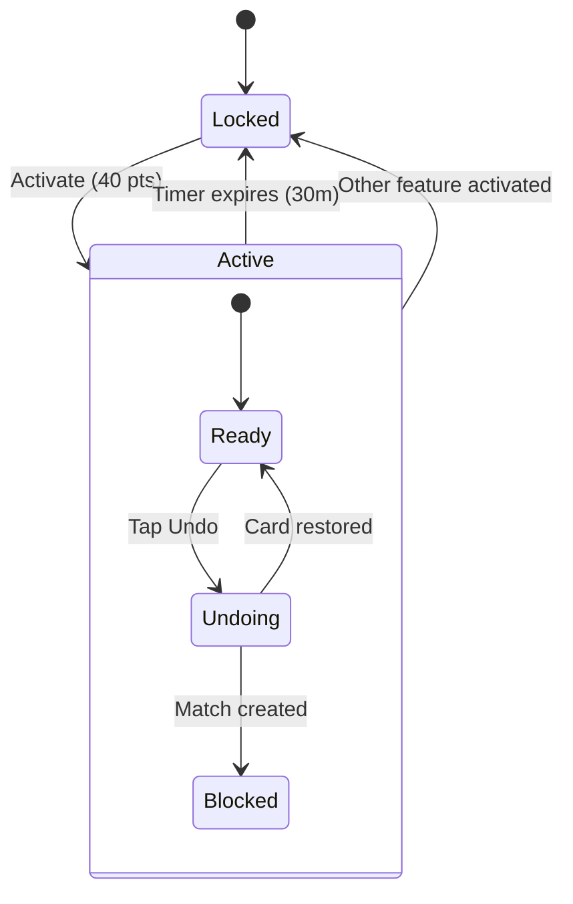
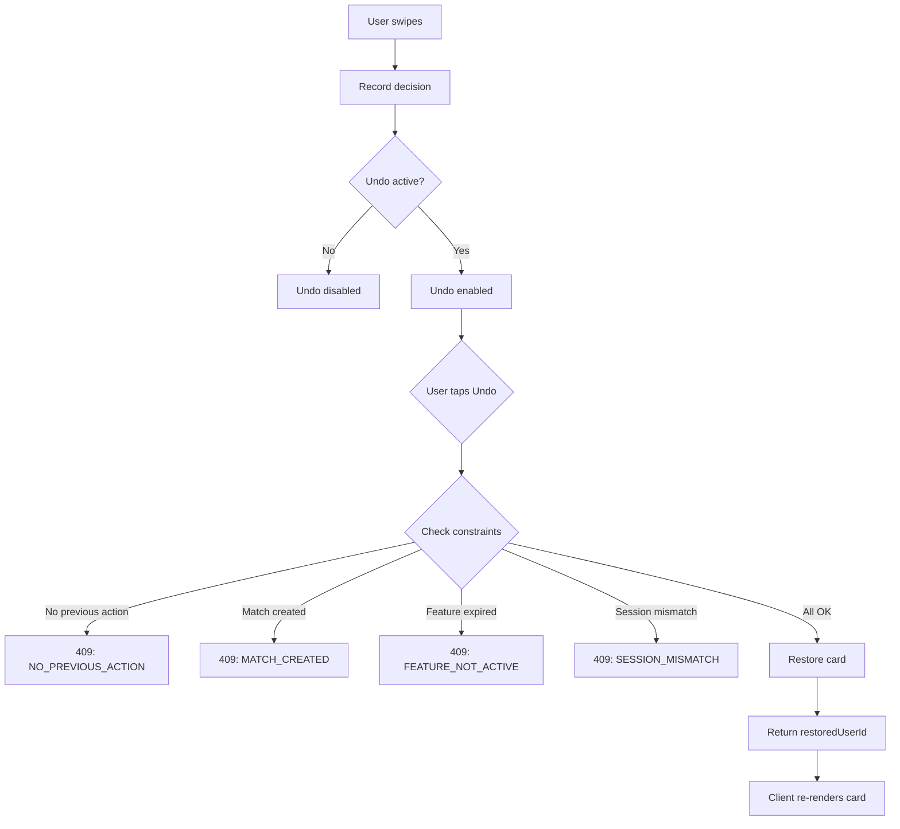

# ↩️ Pulse — Undo Backtrack Logic

> **Developer-Ready Specification (V1, Locked)**

---

## 1️⃣ מטרת הפיצ׳ר

לאפשר למשתמש לבצע Undo (להחזיר את הכרטיס האחרון) לפרק זמן קצר, כדי:
- להוריד חיכוך
- לתת "טעימה" פרימיום
- לא לפגוע בערך המנוי (כלומר: זה זמני ומוגבל בהיקף שימוש)

---

## 2️⃣ פרמטרים מוצריים (Locked)

| Parameter | Value |
|-----------|-------|
| **משך** | 30 דקות |
| **מחיר** | 40 נקודות |
| **שימוש** | Unlimited undo taps בזמן הפעלה |
| **Scope** | רק במסכי swipe-based (Home / Nearby Browse וכו') |
| **לא כולל** | Undo רטרואקטיבי (לא מחזיר החלטות ישנות) |

---

## 3️⃣ מה נחשב "Undo" במוצר

Undo מחזיר את האינטראקציה האחרונה של המשתמש ב־swipe:

| Action | Undo Allowed |
|--------|--------------|
| Pass (Swipe left) | ✅ תמיד |
| Like (Swipe right) | ✅ אם לא נוצר Match |
| Like שיצר Match | ❌ חסום |
| Super-like (V1) | ❌ לא נכלל |

**💡 כלל:** Undo מתייחס רק ל־**last action** בתוך אותה סשן swipe.

---

## 4️⃣ Undo Constraints (קריטי)

### 4.1 Only 1 Step Back

- Undo תמיד מחזיר רק את הכרטיס האחרון
- אחרי Undo אחד, המשתמש יכול שוב swipe ואז שוב Undo, וכו'
- **Unlimited** בזמן חלון ה־30 דקות

### 4.2 No Retroactive Undo

אם המשתמש עזב את מסך swipe, עבר למסך אחר, וחזר:
- ה־undo stack יכול להישמר רק אם זה אותו **session-id**
- אבל אין "שחזור" של פעולות עבר אבודות

אם עבר זמן/נוצר feed מחדש:
- **אין undo**

### 4.3 Server is Source of Truth

השרת צריך להחזיק:
- `lastSwipeAction`
- `sessionId`
- `timestamp`

**הלקוח לא קובע לבדו "מה הכרטיס האחרון".**

---

## 5️⃣ UX Behavior

### Locked State (ללא Undo פעיל)

כפתור Undo (אם קיים ב־UI):
- **Disabled** או מוסתר

אם המשתמש לוחץ:
- Gate prompt (Points hub / subscribe) לפי החלטת מוצר

### Active State (במהלך 30 דק)

- כפתור Undo **פעיל**
- Tap ← מבצע Undo מיידית
- ❌ אין confirmations
- ❌ אין אנימציות חוגגות
- UI מחזיר את אותו כרטיס למעלה

### Expired State

- Undo חוזר ל־**disabled**
- אם המשתמש מנסה Undo:
  - חסימה + reason

---

## 6️⃣ Data & Feed Rules

### 6.1 Undo Must Be Consistent

כאשר מתבצע Undo:

**השרת:**
- מוחק/מבטל את ה־decision האחרון (Like/Pass)
- מחזיר את אותו userId שוב לראש הפיד (או next card)

**הלקוח:**
- מציג אותו כרטיס כאילו לא הוחלט עליו עדיין

### 6.2 Side Effects (לייק)

אם Like יוצר:
- "like record"
- או "match"

אז Undo:
- חייב לבטל גם את התוצאה

**🔒 Locked Rule ל־V1:**

| Scenario | Undo Behavior |
|----------|---------------|
| Pass | ✅ תמיד מותר |
| Like (no match) | ✅ מותר, like מתבטל |
| Like (created match) | ❌ חסום עם הודעה |

הודעת חסימה: **"Can't undo after a match"**

---

## 7️⃣ Edge Cases (חובה)

| Case | Expected |
|------|----------|
| Undo כשאין פעולה קודמת | disabled / error 409 |
| Undo אחרי refresh feed | לא אפשרי |
| Undo בזמן שהפיצ׳ר פג | חסום עם reason |
| User force close | הטיימר ממשיך |
| החלפת Feature נקודות | Undo נסגר מייד אם הופעל Feature אחר |

---

## 8️⃣ State Machine

---

## 🔒 מה אסור למפתחים לעשות ❌

| Forbidden | Reason |
|-----------|--------|
| ❌ Multi-step undo | Only 1 step back allowed |
| ❌ Retroactive undo | No restoring old decisions |
| ❌ Client-side undo stack | Server is source of truth |
| ❌ Undo after match | Breaks match flow |
| ❌ Undo outside swipe screens | Scope is swipe-only |
| ❌ Celebration animations | Silent feature |

---

## ✅ Acceptance Criteria

- [ ] 30 דקות מדויקות, שרת
- [ ] Unlimited taps בתוך חלון
- [ ] One-step-back בלבד
- [ ] No retroactive
- [ ] Scope רק swipe screens
- [ ] לא "שובר" match flows
- [ ] Feature switching works
- [ ] Session management correct

---

## 📊 Flow Diagram

---

**Last Updated:** January 2026  
**Version:** 1.0
