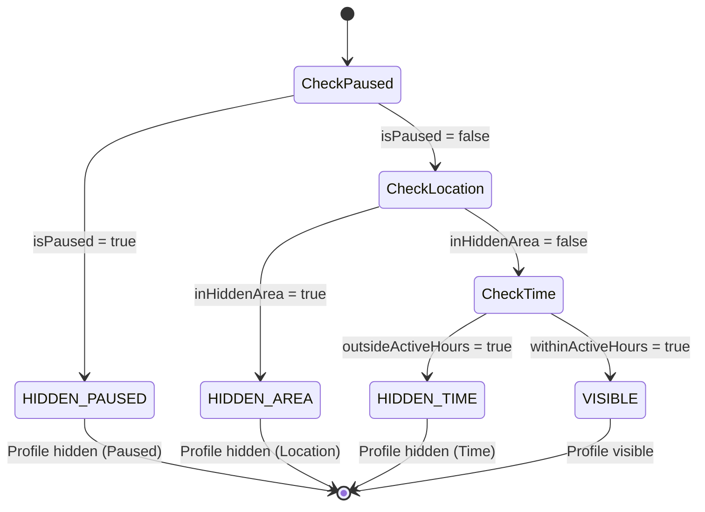
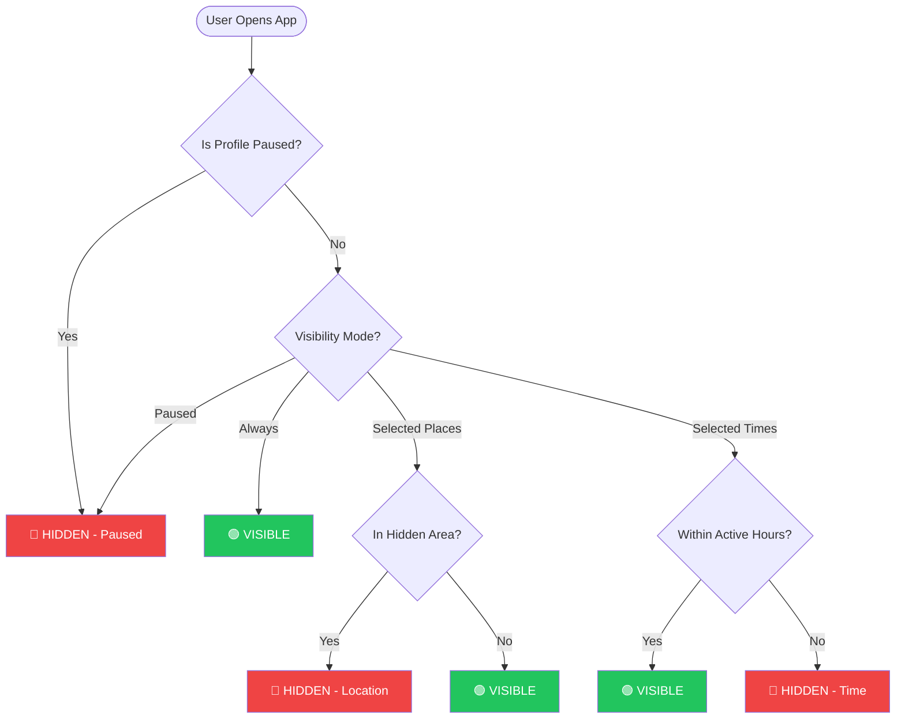
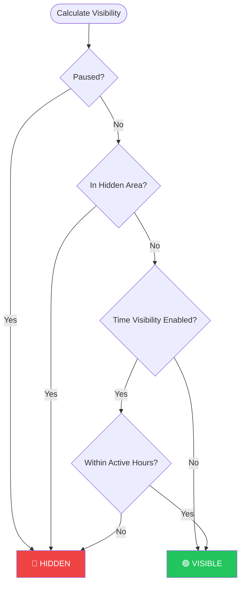
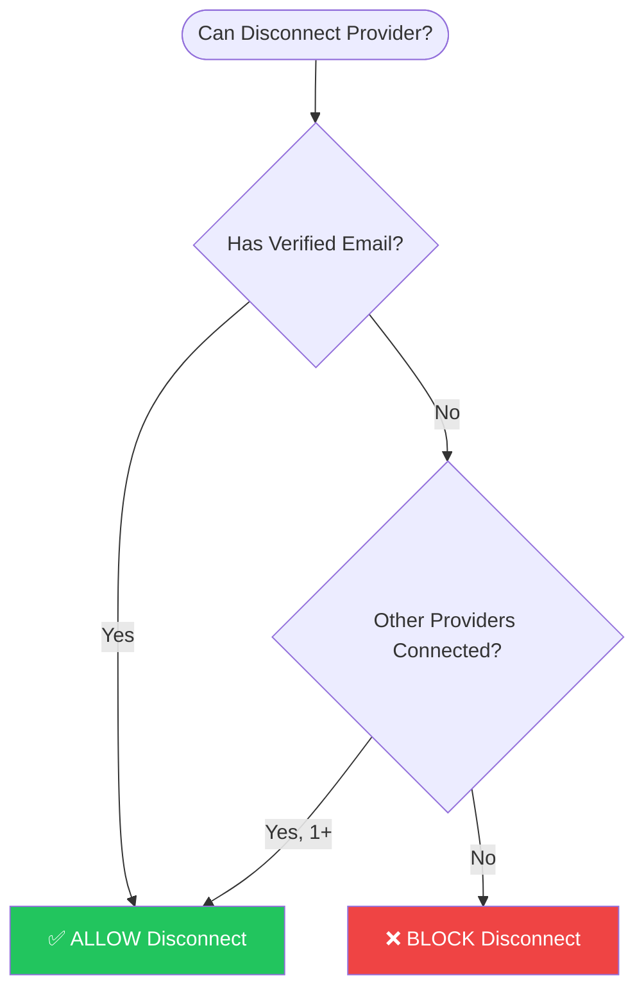
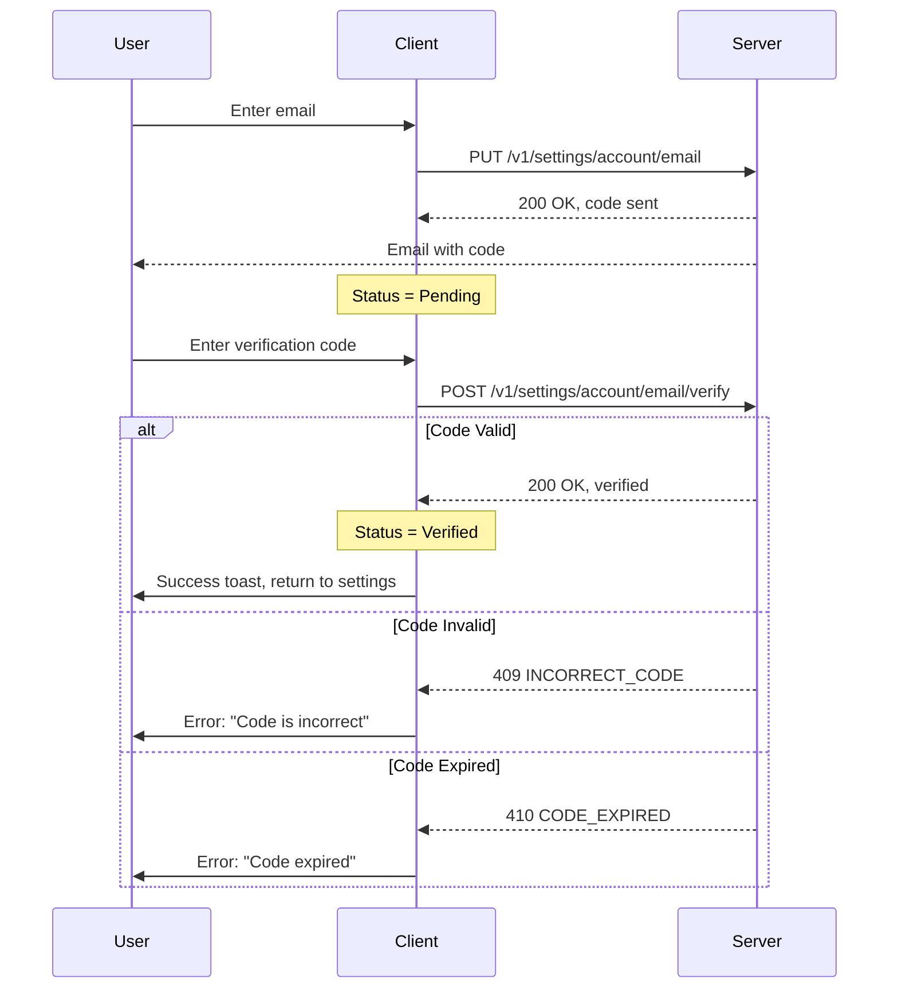
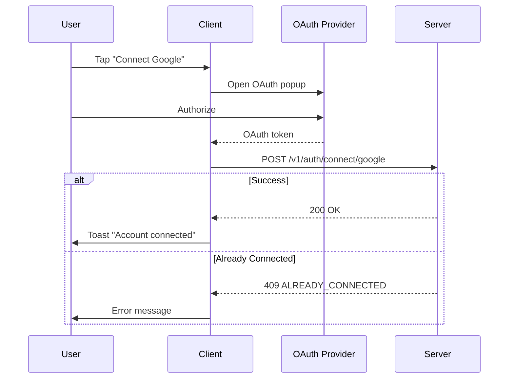

# 🔄 Pulse Visibility Logic Flow

> **State Machine & Priority Rules for Profile Visibility**

---

## Priority Order (Absolute)

```
Paused > Hidden Area > Time Visibility > Always Visible
```

---

## State Machine Diagram



---

## Decision Flow



---

## Combined Visibility Check



---

## Visibility Status Calculation (Code Reference)

```javascript
const calculateVisibilityStatus = (settings) => {
  const {
    isPaused,
    hiddenAreas,
    currentLocation,
    timeVisibility,
    currentTime
  } = settings;

  // Priority 1: Paused (highest)
  if (isPaused) {
    return { visible: false, reason: 'paused' };
  }

  // Priority 2: Hidden Area
  if (hiddenAreas?.length > 0 && currentLocation) {
    const inHiddenArea = hiddenAreas.some(area => 
      isWithinRadius(currentLocation, area)
    );
    if (inHiddenArea) {
      return { visible: false, reason: 'hidden_area' };
    }
  }

  // Priority 3: Time Visibility
  if (timeVisibility?.enabled) {
    const isActiveTime = checkActiveHours(
      currentTime,
      timeVisibility.days,
      timeVisibility.startTime,
      timeVisibility.endTime
    );
    if (!isActiveTime) {
      return { visible: false, reason: 'time_visibility' };
    }
  }

  // Default: Visible
  return { visible: true, reason: null };
};
```

---

## Sign-In Method Safety Logic



```javascript
const canDisconnectProvider = (providerId, state) => {
  const { emailStatus, connectedProviders } = state;
  
  // If email is verified, can always disconnect any provider
  if (emailStatus === 'verified') {
    return true;
  }
  
  // Count other connected providers (excluding the one to disconnect)
  const otherProviders = connectedProviders.filter(
    p => p.connected && p.id !== providerId
  );
  
  // Allow only if there's at least one other provider
  return otherProviders.length > 0;
};
```

---

## Email Verification Flow



---

## Connected Accounts Flow



---

**Last Updated:** January 2026  
**Version:** 1.0
