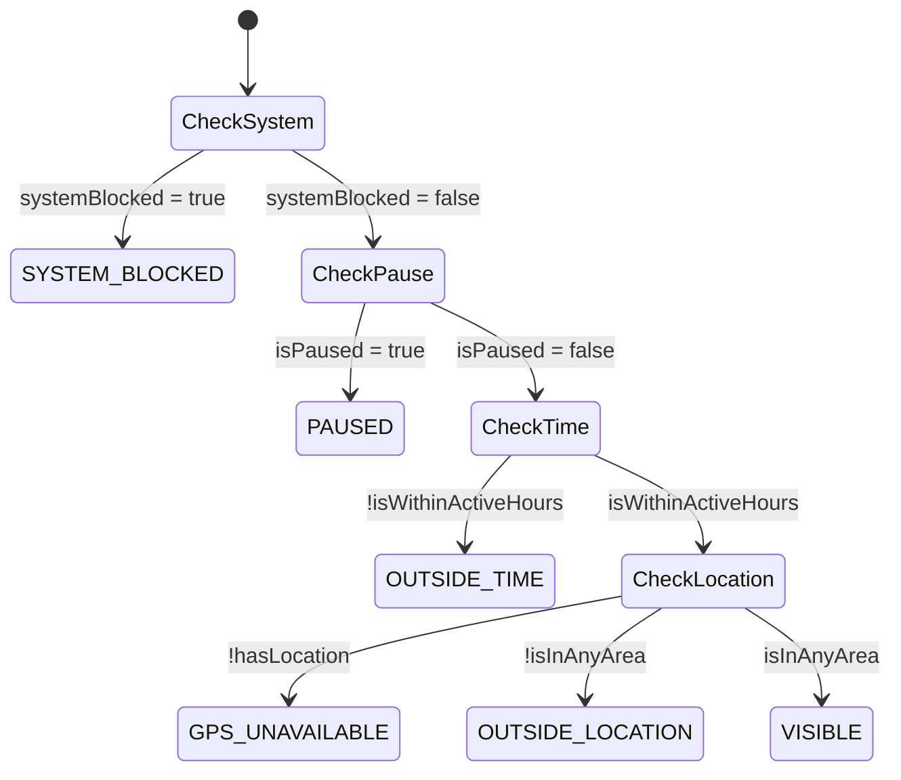

# 📍 Pulse — Visibility Logic

> **Map + Time + Pause (Developer-Ready Specification)**
>
> זה המנוע שקובע אם, מתי ואיפה המשתמש נראה.
> כל באג כאן = חוסר אמון. לכן האפיון חסום לפרשנות.

---

## 1️⃣ מטרת המערכת

לקבוע בזמן אמת:
- האם המשתמש נראה עכשיו
- איפה הוא נראה
- למי הוא נראה

**בלי הפתעות, בלי "נעלמתי בטעות"**

---

## 2️⃣ רכיבי Visibility (Inputs)

הנראות נקבעת משילוב של **4 רכיבים בלבד:**

| # | Component | Description |
|---|-----------|-------------|
| 1 | **Global Pause** | On / Off |
| 2 | **Time Visibility** | ימים + שעות |
| 3 | **Location Visibility** | אזורי מפה |
| 4 | **System Overrides** | Safety / Subscription / Moderation |

**❗ אין Inputs נוספים.**  
**❗ אין ניחושים.**  
**❗ הכל Server-driven.**

---

## 3️⃣ סדר עדיפויות (Locked Priority Order)

המערכת מחשבת נראות לפי הסדר הבא — ברגע שאחד חוסם, הכול נחסם:

```
1. System Override (Ban / Safety)    ← Highest
2. Global Pause
3. Time Visibility
4. Location Visibility               ← Lowest
```

### דוגמאות:

| Scenario | Result |
|----------|--------|
| Pause = ON | לא נראה, גם אם זמן + מיקום פתוחים |
| Time = CLOSED | לא נראה, גם אם נמצא באזור פתוח |
| Location = OUTSIDE | לא נראה, גם אם הזמן פתוח |

---

## 4️⃣ Global Pause

### Purpose
כיבוי מיידי של כל הנראות, בלי לשנות הגדרות אחרות.

### Behavior

**Toggle ON:**
- המשתמש לא נראה בשום מקום
- כל שאר ההגדרות נשמרות (לא מתאפסות)

**Toggle OFF:**
- חזרה מיידית לחישוב רגיל (Time + Location)

### UI Rules
- Toggle אחד בלבד
- טקסט עזר: "You won't be visible anywhere while paused"

### API
```typescript
interface PauseState {
  isPaused: boolean;
  pausedAt?: string; // ISO timestamp
}
```

---

## 5️⃣ Time Visibility

### מבנה נתונים
```typescript
interface TimeVisibility {
  enabled: boolean;
  days: {
    [day: string]: {  // mon, tue, wed, thu, fri, sat, sun
      enabled: boolean;
      from: string;   // "HH:MM"
      to: string;     // "HH:MM"
    }
  };
  timezone: string;   // e.g., "Asia/Jerusalem"
}
```

### חוקים חסומים
- ✅ לפחות יום אחד חייב להיות פעיל
- ✅ `from < to` (אין חציית חצות ב-MVP)
- ✅ שינוי מוחל מיידית

### Edge Cases

| Case | Expected |
|------|----------|
| אין ימים פעילים | פעולה נחסמת + הסבר |
| שעה נוכחית מחוץ לטווח | המשתמש לא נראה |
| שינוי timezone | מחושב מחדש |

---

## 6️⃣ Location Visibility (Map-Based)

### מבנה
```typescript
interface LocationVisibility {
  enabled: boolean;
  areas: Area[];
  maxAreas: number; // e.g., 5
}

interface Area {
  id: string;
  name?: string;
  center: {
    lat: number;
    lng: number;
  };
  radiusMeters: number; // 100 - 5000
  enabled: boolean;
}
```

### חוקים
- ✅ לפחות אזור אחד פעיל
- ✅ אין Overlap resolution — מספיק אזור אחד פתוח
- ✅ אם המשתמש מחוץ לכל האזורים ← לא נראה

### GPS Handling

| GPS Status | Visibility |
|------------|------------|
| Available | Calculate normally |
| Unavailable | `visibility = unknown`, not shown |
| Permission denied | Prompt user, hide meanwhile |

---

## 7️⃣ Visibility Result (Server Output)

השרת מחזיר תמיד מצב מפורש:

```json
{
  "isVisible": true,
  "reason": "VISIBLE",
  "nextChangeAt": "2026-01-07T18:00:00Z",
  "details": {
    "pause": false,
    "timeActive": true,
    "locationActive": true,
    "systemClear": true
  }
}
```

### Possible `reason` Values

| Reason | Description | Priority |
|--------|-------------|----------|
| `SYSTEM_BLOCKED` | Ban / Safety hold | 1 |
| `PAUSED` | Global pause is ON | 2 |
| `OUTSIDE_TIME` | Current time not in active hours | 3 |
| `OUTSIDE_LOCATION` | Not in any visible area | 4 |
| `GPS_UNAVAILABLE` | Can't determine location | 4 |
| `VISIBLE` | All checks passed | - |

**❗ ה-Client לא מפרש, רק מציג.**

---

## 8️⃣ UI Feedback (Client Rules)

### Settings Screen
תמיד מוצג:
- Current status (Visible / Paused / Scheduled / Outside area)
- אם לא נראה: מוצג **למה**, לא רק "Off"

### Status Messages

| Reason | Hebrew | English |
|--------|--------|---------|
| `VISIBLE` | נראה כרגע | Visible now |
| `PAUSED` | מושהה — אינך נראה לאף אחד | Paused — you're hidden everywhere |
| `OUTSIDE_TIME` | מחוץ לשעות הפעילות שלך | Outside your visible hours |
| `OUTSIDE_LOCATION` | אינך באזור נראות כרגע | You're not inside a visible area right now |
| `GPS_UNAVAILABLE` | לא ניתן לקבוע מיקום | Unable to determine location |
| `SYSTEM_BLOCKED` | החשבון מושהה זמנית | Account temporarily suspended |

### Visual Indicators

```
🟢 VISIBLE      - Green dot
🟡 SCHEDULED    - Yellow dot (will be visible at X)
🔴 PAUSED       - Red dot
⚪ OUTSIDE      - Gray dot
```

---

## 9️⃣ Edge Cases (חובה)

| Case | Expected |
|------|----------|
| Pause ON בזמן נראות | נעלם מייד |
| יציאה מאזור פתוח | נעלם |
| כניסה לאזור פתוח | נראה |
| שינוי שעות בזמן אמת | סטטוס מתעדכן |
| GPS כבוי | לא נראה |
| Subscription change | אין השפעה על visibility |
| App backgrounded | Server continues tracking |
| Multiple areas overlap | Visible if in ANY enabled area |

---

## 🔒 מה אסור למפתחים לעשות ❌

| Forbidden | Reason |
|-----------|--------|
| ❌ להציג "אולי נראה" | No ambiguity |
| ❌ להחזיר נראות חלקית | Binary: visible or not |
| ❌ להסתיר סיבות | User must know why |
| ❌ לאפשר מצב "אין אזור ואין זמן" | Must have at least one |
| ❌ לחשב נראות ב-Client | Server only |
| ❌ Cache visibility status | Always fresh from server |

---

## ✅ Acceptance Criteria

- [ ] המשתמש תמיד יודע אם ולמה הוא נראה
- [ ] אין מצב של נראות לא צפויה
- [ ] UI = שיקוף מדויק של שרת
- [ ] Pause תמיד מנצח
- [ ] Time check happens before location
- [ ] At least one day/area must be active
- [ ] Reason is always provided
- [ ] `nextChangeAt` helps UI show countdown

---

## 📊 API Contract

### GET /v1/visibility/status
```json
{
  "isVisible": false,
  "reason": "OUTSIDE_TIME",
  "nextChangeAt": "2026-01-07T18:00:00Z",
  "currentTime": "2026-01-07T14:30:00Z",
  "timezone": "Asia/Jerusalem"
}
```

### GET /v1/visibility/settings
```json
{
  "pause": {
    "isPaused": false
  },
  "time": {
    "enabled": true,
    "days": {
      "mon": { "enabled": true, "from": "18:00", "to": "23:00" },
      "tue": { "enabled": true, "from": "18:00", "to": "23:00" },
      "wed": { "enabled": false },
      "thu": { "enabled": true, "from": "18:00", "to": "23:00" },
      "fri": { "enabled": true, "from": "14:00", "to": "23:59" },
      "sat": { "enabled": true, "from": "10:00", "to": "23:59" },
      "sun": { "enabled": false }
    },
    "timezone": "Asia/Jerusalem"
  },
  "location": {
    "enabled": true,
    "areas": [
      {
        "id": "area_1",
        "name": "Tel Aviv",
        "center": { "lat": 32.0853, "lng": 34.7818 },
        "radiusMeters": 5000,
        "enabled": true
      }
    ]
  }
}
```

### PATCH /v1/visibility/pause
```json
{ "isPaused": true }
```

### PATCH /v1/visibility/time
```json
{
  "enabled": true,
  "days": { ... }
}
```

### POST /v1/visibility/areas
```json
{
  "name": "Work",
  "center": { "lat": 32.0853, "lng": 34.7818 },
  "radiusMeters": 500
}
```

### DELETE /v1/visibility/areas/{areaId}

---

## 🔄 State Machine



---

**Last Updated:** January 2026  
**Version:** 1.0
